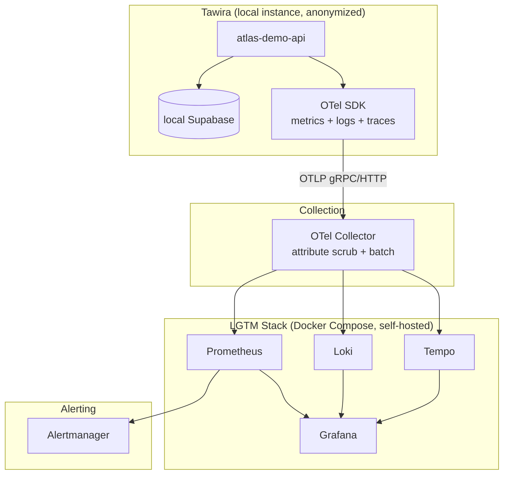

# Atlas Observability

> Full-stack observability for the Atlas platform — metrics, logs, and
> traces from a real application, self-hosted at zero cost.

## Problem Statement

Managed observability (Grafana Cloud, Datadog, hosted Prometheus)
hides the operational complexity it's solving — you get dashboards
without ever having to run the stack that produces them. Atlas
Observability builds the full LGTM stack (Prometheus, Grafana, Loki,
Tempo) self-hosted, instruments a real application with
OpenTelemetry, and proves the result with real telemetry, not
synthetic load — all provable without a hosted observability bill.

## A note on anonymization

The telemetry in this repo comes from Tawira, a production SaaS
application I run — not a sample app. Service names, route names, and
other identifying details are genericized (`atlas-demo-*`) because
Tawira is private; the metrics, traces, and error patterns themselves
are unmodified and real. Tawira runs locally against a local Supabase
instance for this repo's purposes — not against production data — so
instrumentation can be developed and tested without touching a live
system with real users. See
[ADR-0001](docs/adr/ADR-0001-use-tawira-instead-of-sample-app.md) for
why a real app was chosen over a throwaway one, consistent with the
same decision in
[`atlas-security`](https://github.com/spacecode-art/atlas-security).

## Overview

Atlas Observability is Phase 3 of the Atlas platform. It stands up a
self-hosted LGTM stack via Docker Compose, instruments a real
application with OpenTelemetry, and builds Golden Signals dashboards
and alerting rules against real (anonymized) traffic — proving the
stack works without a managed service doing the hard parts.

---

## Objectives

- Full LGTM stack (Prometheus, Grafana, Loki, Tempo) via Docker Compose
- OpenTelemetry instrumentation on Tawira (anonymized), covering
  metrics, structured logs, and distributed traces
- Golden Signals dashboards (latency, traffic, errors, saturation)
  built against real (anonymized) traffic
- Alertmanager rules, tested against synthetic/replayed data
- Document every non-trivial decision as an ADR, same discipline as
  `atlas-foundation` and `atlas-security`

---

## Architecture Diagram



---

## Repository Structure

```text
atlas-observability/
├── .github/
│   └── workflows/            # CI (repository validation)
├── docs/
│   ├── adr/                  # Architecture Decision Records
│   ├── diagrams/              # (currently empty — architecture diagram is inline in README, above)
│   ├── evidence/               # Committed proof-of-work
│   ├── threat-model.md         # STRIDE threat model
│   └── incident-runbook.md     # Operational runbook
├── otel-collector/
│   └── config.yaml            # OTLP receivers, attribute scrub, exporters
├── prometheus/
│   └── prometheus.yml
├── loki/
│   └── loki-config.yaml
├── tempo/
│   └── tempo-config.yaml
├── alertmanager/
│   └── alertmanager.yml
├── dashboards/
│   └── grafana/
│       ├── provisioning/
│       │   ├── datasources/datasources.yml
│       │   └── dashboards/dashboard.yml
│       └── dashboards/         # golden-signals.json — live, verified against real Tawira traffic
├── .editorconfig
├── .gitignore
├── CHANGELOG.md
├── CONTRIBUTING.md
├── LICENSE
├── docker-compose.yml
└── README.md
```

---

## Technology Choices

| Choice | Why this, not the alternative |
|---|---|
| **Self-hosted LGTM stack** over Grafana Cloud/Datadog | Zero cost, and running the stack yourself is a stronger skill signal than consuming a managed dashboard. |
| **OpenTelemetry** over vendor-specific SDKs | Vendor-neutral instrumentation — the same OTel SDK config works whether the backend is this self-hosted stack or a managed one later. |
| **Tawira (real app)** over a throwaway sample app | Real, evolving traffic produces real, evolving telemetry — same reasoning as `atlas-security` ADR-0001. |
| **Local Tawira + local Supabase** over pointing at production | Zero risk to a real system with real users; instrumentation proof doesn't require live user traffic, only real code paths under real (self-generated) load. |
| **Attribute-scrub processor in the Collector** over relying on the SDK alone | Defense in depth — anonymization is enforced at the source (SDK config) *and* at the collector, so a misconfigured service name doesn't leak identifying data by itself. |

---

## Deployment Guide

**Prerequisites:** Docker, Docker Compose, Supabase CLI (for local Tawira).

```bash
# 1. Start the LGTM stack
docker compose up -d

# 2. Verify each service is healthy
docker compose ps

# 3. Grafana: http://localhost:3000 (anonymous viewer access enabled)
# 4. Prometheus: http://localhost:9090
# 5. Alertmanager: http://localhost:9093
```

Tawira instrumentation: wired in and verified end-to-end against
`vite dev` (`npm run dev:otel`, `NITRO_PRESET=node-server`) — see
Current Status below. The built Docker/production Nitro path has
been confirmed to build, pass its security scan, and get signed
(CI), but OTel telemetry has **not** been separately verified from
the running built container — a real gap, tracked in Future Roadmap.

---

## Current Status

**Built:**
- `docker-compose.yml` — full LGTM stack (Prometheus, Loki, Tempo,
  Grafana, Alertmanager) plus an OTel Collector with an
  attribute-scrubbing processor as a second anonymization layer
- Grafana provisioned with all three datasources (Prometheus, Loki,
  Tempo) pre-wired, including trace-to-logs and trace-to-metrics
  correlation, with explicit `uid`s pinned so that correlation
  can't silently break across Grafana versions
- Full stack verified running end-to-end: all six services confirmed
  healthy via readiness-endpoint checks, not just `docker compose ps`
  (see [`docs/evidence/stack-health-check.md`](docs/evidence/stack-health-check.md)).
  A startup readiness race in Loki/Tempo was investigated and found
  to be expected behavior, not a bug (ADR-0002)
- Tawira instrumented with the OTel SDK (traces, logs, metrics),
  including a real breaking-change bug found, fixed, and verified
  against a live Tempo trace (ADR-0003)
- Golden Signals dashboard, built against real (anonymized) Tawira
  traffic — request rate, error rate, p50/p95/p99 latency, status
  code breakdown, event-loop/heap saturation, and Collector pipeline
  health. Every metric name verified against live Prometheus data,
  not just published `.d.ts` source (see
  [`docs/evidence/golden-signals-verification.md`](docs/evidence/golden-signals-verification.md))
- Alertmanager: severity-routed to Slack (critical/warning), rules
  covering error rate, latency, event-loop saturation, and target
  liveness. Proven end-to-end with synthetic alerts confirmed
  delivered in Slack, not just config-valid (see
  [`docs/evidence/alertmanager-slack-verification.md`](docs/evidence/alertmanager-slack-verification.md))

- Local Supabase (via `supabase start`) instrumented end-to-end with
  Tawira, including a real multi-bug postmortem (env-runner's Vercel
  dev-preset sandbox, a corrupted Vite cache, and a Prometheus
  HELP-string collision) — see Postmortem Example below

**Not yet built, tracked honestly:**
- Demo video

---

## Cost Model

**$0 spent.** The entire stack runs via Docker Compose on a local
machine — Prometheus, Loki, Tempo, Grafana, Alertmanager, and the OTel
Collector are all free/open-source, self-hosted. Tawira runs locally
against a local Supabase instance, not a hosted/paid Supabase project.

---

## Design Decisions (ADRs)

| ADR | Decision |
|---|---|
| 0001 | Use Tawira (private production SaaS) instead of a throwaway sample app |
| 0002 | Loki/Tempo ring-readiness startup race — accepted, not a bug |
| 0003 | Pass exporters via options object to `Batch*Processor` constructors — OTel v2.x breaking change from the older positional-argument API |
| 0004 | Drop `instrumentation-http`'s `http.client.request.duration` at the collector level to resolve a Prometheus HELP-string collision with `instrumentation-undici` |

---

## Testing Strategy

Nothing in this repo is marked "done" on the strength of a config
file parsing cleanly. Every component was proven at the next level up:

- **Config validity**: `promtool check rules` / `amtool check-config`
  run against the exact pinned image versions (both require
  `--entrypoint` overrides — the images set the binary itself as
  `ENTRYPOINT`, so the check subcommand as a bare arg just errors).
- **Metric-shape verification**: every metric name used in the
  dashboard and alert rules was checked against the actual published
  npm tarball source for the pinned OTel package versions, then
  confirmed a second time against live Prometheus query output —
  matching this repo's founding lesson (ADR-0003) that library API
  shape should be verified, not assumed from memory or older docs.
- **End-to-end delivery, not just "config accepted"**: Alertmanager
  routing was proven by firing synthetic alerts through its real API
  and confirming both the correct receiver match *and* actual message
  delivery in Slack — a receiver name in an API response doesn't
  prove a webhook POST succeeded.
- **Only one runtime path checked so far**: Tawira's OTel
  instrumentation has been verified in `vite dev`
  (`NITRO_PRESET=node-server`), not yet in the built Docker/production
  container. Dev-mode success doesn't predict the built bundle —
  this is named as an open gap rather than assumed to be covered,
  since the earlier draft of this README claimed it was checked
  when it wasn't.

---

## Monitoring

Golden Signals dashboard (Grafana, auto-provisioned) covers:

- **Rate** — request rate by HTTP method
- **Errors** — 5xx ratio over a 5m window
- **Duration** — p50/p95/p99 latency via `histogram_quantile`
- **Saturation** — Node.js event-loop utilization and delay p99,
  V8 heap used (via `@opentelemetry/instrumentation-runtime-node`,
  bundled automatically by `auto-instrumentations-node`, no explicit
  wiring required)

Alerting (Alertmanager, routed to Slack by severity):

| Alert | Condition | Severity |
|---|---|---|
| `HighErrorRate` | 5xx ratio > 5% for 5m | critical |
| `HighLatencyP99` | p99 latency > 2s for 5m | warning |
| `EventLoopSaturation` | event-loop utilization > 0.9 for 5m | warning |
| `TargetDown` | any scrape target unreachable for 2m | critical |

Distributed tracing (Tempo, via Grafana Explore): confirmed rendering
a full nested trace across the Vite dev process and the spawned
`env-runner` worker process, with correct W3C trace-context
propagation across the process boundary — see ADR-0003 for the
investigation this came out of.

**Known gap**: the worker process's `service.name` resource attribute
reads `atlas-demo-apib` — a stray trailing `b` — instead of
`atlas-demo-api`. Confirmed present in both raw trace data and the
`exported_job` label on metrics (wider than originally scoped).
Logged, not yet fixed; next step is `grep -rn OTEL_SERVICE_NAME
node_modules/env-runner/dist/runners/node-worker/worker.mjs`.

---

## Threat Model

Full STRIDE analysis: [`docs/threat-model.md`](docs/threat-model.md).
Grounded in this repo's actual config and session evidence, not
generic boilerplate — two findings were verified against upstream
source rather than assumed, and one (the unauthenticated Alertmanager
write API) was demonstrated directly via the synthetic-alert curls
used for the Slack routing proof.

**Every service in this stack is unauthenticated at the network
layer** — a deliberate, stated tradeoff for local-only deployment,
not an oversight.

| Finding | Category | Status |
|---|---|---|
| OTLP receivers accept unauthenticated ingest from any reachable client | Spoofing | Accepted risk, local-only |
| Alertmanager's write API has no auth — demonstrated this session via curl | Tampering | Accepted risk, local-only |
| Slack webhook URL pasted in plaintext during setup (real incident) | Information Disclosure | Fixed — routed through `api_url_file`, webhook rotated |
| `--web.enable-lifecycle` exposes unauthenticated `POST /-/quit`, verified against Prometheus v2.55.1 source | Denial of Service | Accepted risk, local-only |
| Grafana anonymous Viewer can run arbitrary PromQL/LogQL via Explore | Information Disclosure | Partially mitigated — Collector's `attributes/scrub` processor means no identifying data reaches Prometheus/Loki to query in the first place |

**What would actually need to change before any public exposure**:
auth extension on the OTLP receiver, a reverse proxy in front of
every service (Alertmanager, Prometheus, Loki, Tempo, Collector
self-telemetry), dropping `--web.enable-lifecycle`, and disabling
Grafana anonymous access. None of this is built — correctly, per this
repo's zero-cost/local-only scope — but it's named explicitly rather
than left implicit.

## Incident Runbook

Full runbook: [`docs/incident-runbook.md`](docs/incident-runbook.md).
Five scenarios, each mapped to a real alert rule in
`prometheus/alert-rules.yml` or a finding directly demonstrated in
`docs/threat-model.md` — not generic filler.

| Scenario | Trigger | Coverage |
|---|---|---|
| Prometheus killed via unauthenticated `/-/quit` | Threat model finding | ⚠️ Detection gap: indistinguishable in logs from a normal restart |
| Fake alert injected via Alertmanager's unauthenticated API | Threat model finding | Detectable — compare Prometheus's own rule state against Alertmanager's active alerts |
| Collector pipeline stalled | Golden Signals dashboard goes flat | `TargetDown`, Pipeline Health panels |
| High error rate / latency | Dashboard + trace correlation | `HighErrorRate`, `HighLatencyP99` |
| Event loop saturation | Dashboard | `EventLoopSaturation` |

The two security-driven scenarios have **no alert coverage today** —
stated plainly in the runbook itself, matching the threat model's
own accepted-risk framing rather than implying it's handled.

## CI/CD

[`​.github/workflows/ci.yml`](.github/workflows/ci.yml) runs on every PR and push to `main`. Currently a single job: secrets scanning via `atlas-security`'s reusable `reusable-secrets-scan.yml` workflow (pinned to `v1.0.4`) — this repo consumes the cross-repo security tooling built in Phase 2 rather than duplicating it.

**Deliberately not yet in CI**: linting, dashboard JSON schema validation, `docker compose config` validation. This is an observability stack, not an application with a build step — most of what would normally run in CI (does the stack start, do the dashboards render) currently only gets exercised by the manual verification workflow documented in `docs/evidence/`. Worth automating before treating this repo as "done," not before.

## Security Review

Full threat model: [`docs/threat-model.md`](docs/threat-model.md) (STRIDE). This section is the narrower, CI/tooling-facing complement to that document.

- **Secrets scanning**: enforced in CI on every PR (see CI/CD above). Caught nothing in this repo's history, but the discipline exists — and this repo has a real incident to point to as evidence it's not theoretical: a live Slack webhook URL was pasted in plaintext in chat during Phase 3 setup, caught and rotated, documented in the threat model rather than quietly fixed.
- **No SAST/dependency scanning configured for this repo specifically** — it's a Docker Compose config repo with no application code of its own to scan; the real attack surface (unauthenticated OTLP/Alertmanager/Grafana endpoints) is covered by the threat model's STRIDE analysis instead, since static analysis tools don't catch "this service has no auth" in a compose file.
- **Known unauthenticated surfaces**, accepted for local-only scope, enumerated in full in the threat model: OTLP receiver, Alertmanager's write API, Prometheus's `/-/quit` lifecycle endpoint, Grafana anonymous Viewer access.

## Cost Analysis

**Actual spend: $0.** For comparison, running the equivalent managed stack:

| Component | This repo (self-hosted) | Managed equivalent | Approx. managed cost |
|---|---|---|---|
| Metrics + dashboards | Prometheus + Grafana, Docker Compose | Grafana Cloud (Pro tier) | ~$49–299/mo depending on active series |
| Log aggregation | Loki, Docker Compose | Grafana Cloud Logs / Datadog Logs | ~$0.10–2.50/GB ingested |
| Distributed tracing | Tempo, Docker Compose | Grafana Cloud Traces / Honeycomb | ~$0.50–5/GB ingested |
| Alerting | Alertmanager, Docker Compose | PagerDuty / Opsgenie (routing only, Grafana Cloud alerting) | ~$21+/user/mo |

At this repo's actual traffic volume (a handful of requests/minute from a single demo app), any of the above would likely sit on a free/trial tier — the comparison matters at production scale, not at this repo's current volume. The point being demonstrated isn't "this saves money right now," it's that the same LGTM architecture managed services are built on is fully reproducible at zero cost for evaluation, development, and portfolio purposes — see the roadmap's zero-cost philosophy (`atlas-foundation`) for the full reasoning.

## Postmortem Example

**Incident: Golden Signals dashboard showing zero data despite a correctly-wired OTel pipeline**

*Date: 2026-09-04–07. Severity: blocking (Phase 3 could not close). Duration: ~1 session, multiple false starts.*

**Impact**: local Supabase → Tawira → OTel Collector → Prometheus pipeline appeared completely non-functional. `http_server_request_duration_seconds` returned empty on every query, blocking verification that Phase 3's observability stack actually worked end-to-end against real (if local) traffic.

**Timeline** (condensed — full raw evidence in `docs/evidence/`):
1. Diagnosed `dev:otel` defaulting to Nitro's `vercel` preset, routing SSR through `env-runner`'s workerd sandbox — a separate JS runtime `instrumentation-http`'s `--import` hook can't reach. Fixed with `NITRO_PRESET=node-server`.
2. That surfaced a second, unrelated fault: a corrupted Vite dependency-optimizer cache from multiple concurrent `dev:otel` processes stacking up during earlier debugging. Fixed with `rm -rf node_modules/.vite`.
3. With the app now instrumented correctly and traffic flowing, `OTEL_DEBUG=1` confirmed real `http.server` spans being generated and queued for export — but Prometheus still showed nothing.
4. Root cause found in the collector's own logs: `instrumentation-http@0.222.0` and `instrumentation-undici@0.32.0` both register a metric named `http.client.request.duration` with different HELP text, which fails Prometheus's `client_golang` registry check on every scrape. Fixed at the collector level with a `filter` processor (ADR-0004) rather than disabling either instrumentation, preserving both server-metric and real outbound-call visibility.
5. Verified live: spans, server metrics, and client metrics all confirmed flowing with zero export errors.

**What went wrong in the process, not just the code**: multiple early conclusions were drawn from partial evidence — a `git status`-dirty working copy was mistaken for the committed state during a separate lockfile investigation, and an initial hypothesis blamed the vercel-preset architecture for a crash that was more likely caused by cache corruption, a claim never actually isolated and tested. Both were caught and corrected before being written down as fact, but only because verification against raw evidence (`git show HEAD:...`, live Prometheus queries, collector logs) was treated as non-negotiable throughout — exactly the discipline this repo's threat model and prior ADRs already establish.

**Follow-ups**: the `atlas-demo-apib` trailing-`b` service-name bug (pre-existing, independently reconfirmed during this incident) is still open — tracked in the Monitoring section above.

## Future Roadmap

- Fix the `atlas-demo-apib` trailing-`b` service name bug in `env-runner`'s worker process (tracked in Monitoring)
- Verify OTel telemetry actually flows from the **built** Docker/production Nitro container, not just `vite dev` — currently unverified (see Testing Strategy)
- Add browser-side OTel instrumentation for Tawira's client-fetch-heavy data layer (currently only server-side/`createServerFn` calls are traced — see the postmortem above for why)
- CI: dashboard JSON schema validation, `docker compose config` validation on PR
- Auth in front of every service before any deployment beyond local-only (OTLP receiver, Alertmanager, Grafana anonymous access, Prometheus `--web.enable-lifecycle`) — full list in the threat model
- Migrate this stack onto Oracle Cloud's Always Free tier for a permanently-reachable public demo, per the roadmap's zero-cost toolkit

## Documentation

Additional documentation is available under the `docs/` directory.
Architecture decisions are recorded using ADRs in `docs/adr/`.

## Contributing

Please read `CONTRIBUTING.md` before submitting changes.

## License

This project is licensed under the MIT License.
