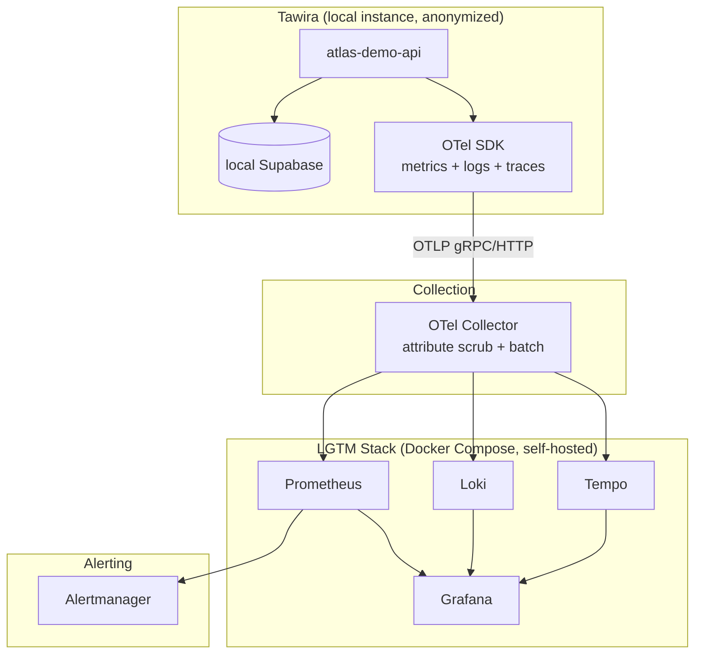

# Atlas Observability

> Full-stack observability for the Atlas platform — metrics, logs, and
> traces from a real application, self-hosted at zero cost.

## Problem Statement

Managed observability (Grafana Cloud, Datadog, hosted Prometheus)
hides the operational complexity it's solving — you get dashboards
without ever having to run the stack that produces them. Atlas
Observability builds the full LGTM stack (Prometheus, Grafana, Loki,
Tempo) self-hosted, instruments a real application with
OpenTelemetry, and proves the result with real telemetry, not
synthetic load — all provable without a hosted observability bill.

## A note on anonymization

The telemetry in this repo comes from Tawira, a production SaaS
application I run — not a sample app. Service names, route names, and
other identifying details are genericized (`atlas-demo-*`) because
Tawira is private; the metrics, traces, and error patterns themselves
are unmodified and real. Tawira runs locally against a local Supabase
instance for this repo's purposes — not against production data — so
instrumentation can be developed and tested without touching a live
system with real users. See
[ADR-0001](docs/adr/ADR-0001-use-tawira-instead-of-sample-app.md) for
why a real app was chosen over a throwaway one, consistent with the
same decision in
[`atlas-security`](https://github.com/spacecode-art/atlas-security).

## Overview

Atlas Observability is Phase 3 of the Atlas platform. It stands up a
self-hosted LGTM stack via Docker Compose, instruments a real
application with OpenTelemetry, and builds Golden Signals dashboards
and alerting rules against real (anonymized) traffic — proving the
stack works without a managed service doing the hard parts.

---

## Objectives

- Full LGTM stack (Prometheus, Grafana, Loki, Tempo) via Docker Compose
- OpenTelemetry instrumentation on Tawira (anonymized), covering
  metrics, structured logs, and distributed traces
- Golden Signals dashboards (latency, traffic, errors, saturation)
  built against real (anonymized) traffic
- Alertmanager rules, tested against synthetic/replayed data
- Document every non-trivial decision as an ADR, same discipline as
  `atlas-foundation` and `atlas-security`

---

## Architecture Diagram



---

## Repository Structure

```text
atlas-observability/
├── .github/
│   └── workflows/            # CI (repository validation)
├── docs/
│   ├── adr/                  # Architecture Decision Records
│   ├── diagrams/              # Architecture diagrams
│   ├── evidence/               # Committed proof-of-work
│   ├── threat-model.md         # STRIDE threat model
│   └── incident-runbook.md     # Operational runbook
├── otel-collector/
│   └── config.yaml            # OTLP receivers, attribute scrub, exporters
├── prometheus/
│   └── prometheus.yml
├── loki/
│   └── loki-config.yaml
├── tempo/
│   └── tempo-config.yaml
├── alertmanager/
│   └── alertmanager.yml
├── dashboards/
│   └── grafana/
│       ├── provisioning/
│       │   ├── datasources/datasources.yml
│       │   └── dashboards/dashboard.yml
│       └── dashboards/         # Golden Signals dashboard JSON (pending real data)
├── .editorconfig
├── .gitignore
├── CHANGELOG.md
├── CONTRIBUTING.md
├── LICENSE
├── docker-compose.yml
└── README.md
```

---

## Technology Choices

| Choice | Why this, not the alternative |
|---|---|
| **Self-hosted LGTM stack** over Grafana Cloud/Datadog | Zero cost, and running the stack yourself is a stronger skill signal than consuming a managed dashboard. |
| **OpenTelemetry** over vendor-specific SDKs | Vendor-neutral instrumentation — the same OTel SDK config works whether the backend is this self-hosted stack or a managed one later. |
| **Tawira (real app)** over a throwaway sample app | Real, evolving traffic produces real, evolving telemetry — same reasoning as `atlas-security` ADR-0001. |
| **Local Tawira + local Supabase** over pointing at production | Zero risk to a real system with real users; instrumentation proof doesn't require live user traffic, only real code paths under real (self-generated) load. |
| **Attribute-scrub processor in the Collector** over relying on the SDK alone | Defense in depth — anonymization is enforced at the source (SDK config) *and* at the collector, so a misconfigured service name doesn't leak identifying data by itself. |

---

## Deployment Guide

**Prerequisites:** Docker, Docker Compose, Supabase CLI (for local Tawira).

```bash
# 1. Start the LGTM stack
docker compose up -d

# 2. Verify each service is healthy
docker compose ps

# 3. Grafana: http://localhost:3000 (anonymous viewer access enabled)
# 4. Prometheus: http://localhost:9090
# 5. Alertmanager: http://localhost:9093
```

Tawira instrumentation and local Supabase setup: not yet wired in —
see Current Status below.

---

## Current Status

**Built:**
- `docker-compose.yml` — full LGTM stack (Prometheus, Loki, Tempo,
  Grafana, Alertmanager) plus an OTel Collector with an
  attribute-scrubbing processor as a second anonymization layer
- Grafana provisioned with all three datasources (Prometheus, Loki,
  Tempo) pre-wired, including trace-to-logs and trace-to-metrics
  correlation
- Full stack verified running end-to-end: all six services confirmed
  healthy via readiness-endpoint checks, not just `docker compose ps`
  (see [`docs/evidence/stack-health-check.md`](docs/evidence/stack-health-check.md)).
  A startup readiness race in Loki/Tempo was investigated and found
  to be expected behavior, not a bug (ADR-0002)

**Not yet built, tracked honestly:**
- Tawira is not yet instrumented with the OTel SDK
- Local Supabase instance (via `supabase start`) not yet stood up
- Golden Signals dashboard JSON — deliberately not built yet, since
  building dashboard queries against zero real data means guessing;
  this comes after real telemetry is flowing
- Alertmanager rules — currently a no-op receiver with no rules or
  notification channel configured
- Threat model, incident runbook — not yet written
- Demo video

---

## Cost Model

**$0 spent.** The entire stack runs via Docker Compose on a local
machine — Prometheus, Loki, Tempo, Grafana, Alertmanager, and the OTel
Collector are all free/open-source, self-hosted. Tawira runs locally
against a local Supabase instance, not a hosted/paid Supabase project.

---

## Design Decisions (ADRs)

| ADR | Decision |
|---|---|
| 0001 | Use Tawira (private production SaaS) instead of a throwaway sample app |
| 0002 | Loki/Tempo ring-readiness startup race — accepted, not a bug |

---

## Documentation

Additional documentation is available under the `docs/` directory.
Architecture decisions are recorded using ADRs in `docs/adr/`.

## Contributing

Please read `CONTRIBUTING.md` before submitting changes.

## License

This project is licensed under the MIT License.
